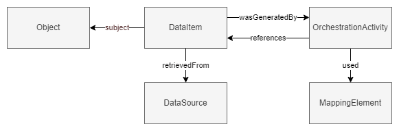

## Requirements and approach
Within this chapter two sections are presented; Requirements and Approach. In the Requirements section the requirements for the information model are listed. In the Approach section the requirements are translated into a conceptual model which forms the basis for the logical model described in [chapter 3](#objectcatalog).

### Requirements

The following requirements have been taken into account in the approach:

1. **We should be able to identify and describe singular data items**
2. **We should be able to describe which data items contributed to the generation of a data item**
3. **We should be able to describe activities that act upon data items**
4. **We should be able to find data items that contributed to the generation of a data item**
5. **We should be able to describe how data item contributed to the generation of a data item**


### Approach

The first requirement, to identify and describe singular pieces data, is realized by the introduction of the data item objecttype as described in [IMX-Metadata](https://geonovum.github.io/IMX-Metadata/#vocabulary).


A [data item](https://geonovum.github.io/IMX-Metadata/#dfn-data-item) can be described from different perspectives. This gives a basic model, applicable for many usecases. The perspective the lineage model takes is one of provenance [[prov-o]]. The lineage model adds to this a way to connect one data item to one or more other data items it [is derived from](https://www.w3.org/TR/prov-o/#wasDerivedFrom). The latter are called [=source data item=]s, the former [=orchestrated data items=].
For the [=source data item=] it is important to know from which [=data source=] it is retrieved so that users can interpret the [=source data item=] in the context it was published in. This also allows allows users to find related information.


| Term                              | Definition                                                                                                                                                  |
| --------------------------------- | ----------------------------------------------------------------------------------------------------------------------------------------------------------- |
| <dfn>source data item</dfn>       | A source data item is a [data item](https://geonovum.github.io/IMX-Metadata/#dfn-data-item) that serves as input for an [=orchestration activity=].         |
| <dfn>orchestrated data item</dfn> | An orchestrated data item is a [data item](https://geonovum.github.io/IMX-Metadata/#dfn-data-item) that is generated/obtained by orchestrating source data. |
| <dfn>data object</dfn>            | A data object is a contextually grouped set of [data items](https://geonovum.github.io/IMX-Metadata/#dfn-data-item).                                        |
| <dfn>data source</dfn>            | A data source is an entity which provides access to a dataset.                                                                                              |

A data example:

```json
{
  "identification": "G0200.42b3d39246840268e0530a0a28492340",
  "constructionDate": "2006",
  "registeredWith": {
    "consistOf": [
      {
        "property": "bouwjaar",
        "value": {
          "stringValue": "2006"
        },
        "subject": {
          "identificatie": "G0200.42b3d39246840268e0530a0a28492340",
          "domein": null
        },
        "wasDerivedFrom": {
          "property": "oorspronkelijkBouwjaar",
          "value": {
            "stringValue": "2006"
          },
          "subject": {
            "identificatie": "0200100000085932",
            "type": "Pand"
          }
        }
      }
    ]
  }
}
```

This, however, does not provide any insight into how the [=source data item=]\(s) were used to generate the [=orchestrated data item=]. In order to allow for this the generation itself is identified as an [=orchestration activity=], which is a type of [activity](https://www.w3.org/TR/prov-o/#Activity). This provides the information that the [data item](https://geonovum.github.io/IMX-Metadata/#dfn-data-item) is generated using orchestration techniques.


```json
{
  "identification": "G0200.42b3d39246840268e0530a0a28492340",
  "constructionDate": "2006",
  "registeredWith": {
    "consistsOf": [
      {
        "property": "bouwjaar",
        "wasGeneratedBy": {
          "used": {
            "property": "oorspronkelijkBouwjaar",
            "value": {
              "stringValue": "2006"
            },
            "subject": {
              "identificatie": "0200100000085932",
              "type": "Pand"
            }
          }
        },
        "value": {
          "stringValue": "2006"
        },
        "subject": {
          "identificatie": "G0200.42b3d39246840268e0530a0a28492340",
          "domein": null
        }
      }
    ]
  }
}
```

Lastly, we provide insights into the transformation itself, the mapping used for the orchestration activity. The mapping is described in a seperate artifact called the [model mapping](https://geonovum.github.io/IMX-ModelMapping/#dfn-imx-model-mapping). This document describes the relation between two models and how data from one can be transformed to the other. The mapping is structured according to the [mapping specification](https://github.com/Geonovum/IMX-ModelMapping). The rules to generate a specific [data item](https://geonovum.github.io/IMX-Metadata/#dfn-data-item) are encompassed in a [property mapping](https://geonovum.github.io/IMX-ModelMapping/#dfn-property-mapping), which is executed during orchestration. To describe this, we introduce a specific type of [=orchestration activity=], the [=property mapping execution=].

| Term                                 | Definition                                                                                                                                                                                                                               |
| ------------------------------------ | ---------------------------------------------------------------------------------------------------------------------------------------------------------------------------------------------------------------------------------------- |
| <dfn>used</dfn>                      | Usage is the beginning of utilizing an entity by an [activity](https://www.w3.org/TR/prov-o/#Activity). Before usage, the activity had not begun to utilize this entity and could not have been affected by the entity. (based on [prov:used](https://www.w3.org/TR/prov-o/#used)) |
| <dfn>orchestration activity</dfn>    | An orchestration activity is an [activity](https://www.w3.org/TR/prov-o/#Activity) that is part of an IMX orchestration process.                                                                                                         |
| <dfn>property mapping execution<dfn> | A Property mapping execution is an [=orchestration activity=] that pertains to the execution of a [property mapping](https://geonovum.github.io/IMX-ModelMapping/#dfn-property-mapping).                                                 |


The [=property mapping execution=] can be deconstructed into several smaller activities as it may include multiple intermediary results; each having a query [path](https://geonovum.github.io/IMX-ModelMapping/#dfn-path-expression) and a [=start node=], which are then combined and/or transformed into the [value](https://geonovum.github.io/IMX-Metadata/#dfn-value) of the [=orchestrated data item=]. The `PropertyMapping` is the main entity describing the steps ([path mappings](https://geonovum.github.io/IMX-ModelMapping/#dfn-path-mapping)) required to derive a specific data item in order of execution. Each step is an activity that informs the [=property mapping execution=]; which yields the [=orchestrated data item=]. As part of the lineage information we refer to elements in the mapping to provide insights into how the [=orchestrated data item=] was constructed. This allows us to convey which data items were used to derive a new data item, and how these were used. Adding this to our lineage model yields the following model.

| Term                              | Definition                                                                                                                                                                                                                       |
| --------------------------------- | -------------------------------------------------------------------------------------------------------------------------------------------------------------------------------------------------------------------------------- |
| <dfn>was informed by</dfn>        | A relation between [activities](https://www.w3.org/TR/prov-o/#Activity) stating that one activity uses some output of the other activity. (based on [prov:wasInformedBy](https://www.w3.org/TR/prov-o/#wasInformedBy))           |
| <dfn>path mapping execution</dfn> | A property path execution is an [activity](https://www.w3.org/TR/prov-o/#Activity) that retrieves [data items](https://geonovum.github.io/IMX-Metadata/#dfn-data-item) to serve as input for the [=property mapping execution=]. |
| <dfn>references</dfn>             | The [=source data item=] referenced by following the defined [path](https://geonovum.github.io/IMX-ModelMapping/#dfn-path-expression) starting from the [=start node=].                                                          |
| <dfn>start node</dfn>             | The [=source object=] from which the [path](https://geonovum.github.io/IMX-ModelMapping/#dfn-path-expression) is followed to find the used data item.                                                                            |

A [path mapping](https://geonovum.github.io/IMX-ModelMapping/#dfn-path-mapping) consists out of one [path](https://geonovum.github.io/IMX-ModelMapping/#dfn-path-expression); possibly yielding any number of [data items](https://geonovum.github.io/IMX-Metadata/#dfn-data-item), when executed. The lineage should give insights on precisely how each [data item](https://geonovum.github.io/IMX-Metadata/#dfn-data-item) was found and how it contributed to the generation of the [=orchestrated data item=]. For each `"OrchestrationActivity -used-> DataItem"` we map to the respective [path](https://geonovum.github.io/IMX-ModelMapping/#dfn-path-expression).

We do this by further deconstructing the [=path mapping execution=] into each [path](https://geonovum.github.io/IMX-ModelMapping/#dfn-path-expression) that is defined in the mapping. For each [=path execution=] that informs the [=path mapping execution=] a [=used=] property is linked to the respective [path](https://geonovum.github.io/IMX-ModelMapping/#dfn-path-expression) in the [model mapping](https://geonovum.github.io/IMX-ModelMapping/#dfn-imx-model-mapping). This allows us to point to the exact mapping element providing the path that leads us to the [=source data item=]. A pointer to the node from which the path is followed is added, this is the [=start node=].

| Term                      | Definition                                                                                                                                           |
| ------------------------- | ---------------------------------------------------------------------------------------------------------------------------------------------------- |
| <dfn>Path execution</dfn> | A path execution is an [=orchestration activity=] that is part of the [=path mapping execution=].                                                    |
| <dfn>source object</dfn>  | A source object is an [object](https://geonovum.github.io/IMX-Metadata/#dfn-object) that that is referenced to create an [=orchestrated data item=]. |


In this model several types have different roles following from incomming relations. This could make the datamodel less clear. In the following diagram roles are made explicit.


In JSON this could look as follows.

```json
{
  "identification": "G0200.42b3d39246840268e0530a0a28492340",
  "constructionDate": "2006",
  "hasLineage": {
    "orchestratedProperties": [
      { <!-- OrchestratedDataItem -->
        "property": "bouwjaar",
        "value": {
          "stringValue": "2006"
        },
        "subject": {
          "identificatie": "G0200.42b3d39246840268e0530a0a28492340",
          "domein": null
        },
        "wasGeneratedBy": { <!-- PropertyMappingExecution -->
          "used" : {  <!-- property mapping -->
            "objectKey": "MAP.IMXGEO.000102",
            "objectType": "PropertyMapping"
          }
          "wasInformedBy": { <!-- PathMappingExecution -->
            "references": { <!-- source data item -->
                "property": "oorspronkelijkBouwjaar",
                "value": {
                  "stringValue": "2006"
                },
                "subject": {
                  "objectKey": "0200100000085932",
                  "objectType": Pand
                }
              },
              "used": { <!-- Path -->
                "path": {
                  "segments": [
                    "isGerelateerdAan",
                    "oorspronkelijkBouwjaar"
                  ]
                }
              },
              "startNode": { <!-- SourceObject -->
                "objectKey": "G0200.42b3d39246840268e0530a0a28492340",
                "objectType": "Pand"
              }
          }
        }
      }
    ]
  }
}
```

When multiple source data items are used this would result in multiple `"wasInformedBy": { ... }` statements within the `"wasGeneratedBy":{ ... }` element.

#### Summary

The requirements are reflected in the model by introducing the following concepts:

- **Data item**
  - "orchestrated data item" for req 1
  - "source data item" for req 2.

  In order to be able to talk about them.
- **Orchestration Activity**
  - Property Mapping execution and propertyMapping execution for req 3

  In order to describe that orchestration took place.
- **Data source** for req 4.

  In order to decribe where source data is retrieved from and thus can be found.
- **Mapping element**
  -  Property Mapping and path for req 5.

  In order to precisely indicate what rules were applied to the source data to derive the orchestrated data item(s).

In short:




#### Limitations

- We don't indicate the order of the activities or path segments which is an important aspect of the mapping
- We don't have a way of describing the (software) agent responsible for the orchestration (can be copied from PROV-O).
- We don't describe objecttype mapping executions.
- ...
