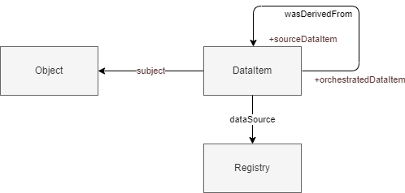

## Requirements and approach

### Requirements

*Beschrijf de inhoudelijke keuzes op hoofdlijnen*


### Approach

From this section on we show the basic notions in a conceptual model and build upon that following the requirements we set. This is done in four increments of increasing complexity.


**Increment one**

The first notion we introduce is that of a single statement, a data element. Information objects are comprised out of multiple atomic pieces of information. Usually captured by one attribute or association. For instance with  Address information:

<pre>
{
  "omschrijving": "Laan van Westenenk 701, 7334DP Apeldoorn",
  "plaatsnaam": "Apeldoorn",
  "identificatie": "0200200000075716",
  "isHoofdadres": true,
  "huisnummer": 701,
  "postcode": "7334DP",
  "straatnaam": "Laan van Westenenk"
}
</pre>

Or, in RDF:

<pre>
<http://example.com/id/adres/0200200000075716> a gebouw:Adres;
  gebouw:postcode "7334DP";
  gebouw:huisnummer 701;
  gebouw:identificatie "0200200000075716";
  gebouw:omschrijving "Laan van Westenenk 701, 7334DP Apeldoorn";
  nen3610:registratiegegevens <http://example.com/base/registratiegegevens-0200200000075716>;
  gebouw:straatnaam "Laan van Westenenk";
  gebouw:plaatsnaam "Apeldoorn";
  gebouw:isHoofdadres true .
</pre>

What we aim to do is identify and provide information about each singular data element, e.g. `{ "plaatsnaam": "Apeldoorn" }` or `<http://example.com/id/adres/0200200000075716> rdf:type gebouw:Adres .`. This is done by treating these statements as objects. In the following diagram both the object and the data elements are modelled as an objecttype, allowing us to describe both.


A data element is identified by it's 1) subject 2) value and 3) property
e.g.
```
{
    "property": "plaatsnaam",
    "value": {
        "stringValue": "Apeldoorn"
    },
    "subject": {
        "identificatie": "0200200000075716",
        "domein": null
    }
}
```

| Term         | Definition                                                            |
| ------------ | --------------------------------------------------------------------- |
| object       | An object is any resource that is the subject of a registration.      |
| data element | A data element is any singular piece of information about a resource. |
| subject      | A subject is an object a data element is about.                       |

Several subtypes of data elements are identified; but these are omitted in the following examples for simplicity's sake.


A data element can be described from different point of views. The perpective the lineage model takes is one of provenance. Questions to be answers are for instance where and by whom, is the statement `Building G0200.42b3d39246840268e0530a0a28492340 has construction date 2006` registered? Other models could address other aspects of a data element; for instance whether it is subject to an examination of correctness (which could be relevant for the BAG: https://catalogus.kadaster.nl/bag/nl/page/InOnderzoek).

A data element is part of the information object describing the object; but this is omitted in the following examples.


**Increment two**

Level one provides the basic model applicable for any usecase. Level two adds in the most basic from, a way to connect one data element to one or more data elements it is derived from. For the latter, it is important to know which registry or dataset it is retrieved from.



<pre>
{
    "identification": "G0200.42b3d39246840268e0530a0a28492340",
    "constructionDate": "2006",
    "registeredWith": {
        "consistOf": [
            {
                "property": "bouwjaar",
                "wasDerivedFrom": {
                    "property": "oorspronkelijkBouwjaar",
                    "value": {
                        "stringValue": "2006"
                    },
                    "subject": {
                        "identificatie": "0200100000085932",
                        "type": Pand
                    }
                },
                "value": {
                    "stringValue": "2006"
                },
                "subject": {
                    "identificatie": "G0200.42b3d39246840268e0530a0a28492340",
                    "domein": null
                }
            }
        ]
    }
}
</pre>

This, however, does not provide any insight into how the source data element(s) were used to generate the data element. In order to allow for this the generation itself is identified as an Activity. With this we can attach backwards data lineage.


<pre>
{
    "identification": "G0200.42b3d39246840268e0530a0a28492340",
    "constructionDate": "2006",
    "registeredWith": {
        "consistsOf": [
            {
                "property": "bouwjaar",
                "wasGeneratedBy": {
                    "used": {
                        "property": "oorspronkelijkBouwjaar",
                        "value": {
                            "stringValue": "2006"
                        },
                        "subject": {
                            "identificatie": "0200100000085932",
                            "type": Pand
                        }
                    }
                },
                "value": {
                    "stringValue": "2006"
                },
                "subject": {
                    "identificatie": "G0200.42b3d39246840268e0530a0a28492340",
                    "domein": null
                }
            }
        ]
    }
}
</pre>

| Term                   | Definition                                                                                                   |
| ---------------------- | ------------------------------------------------------------------------------------------------------------ |
| Orchestration activity | An orchestration activity is an activity that generates a set of data elements based on one or more sources. |


**Increment three**

Next we provide insights into the transformation itself. The transformation is described in a seperate artifact called the mapping document. This document describes the relation between two models and how data from one can be transform to the other. During the orchestration this is used to perform the actual mapping.

For the mapping we follow this [model](https://github.com/Geonovum/WaU-MAP).
As part of the lineage information we want to refer to elements in the mapping to provide insights into how the orchestrated data element was constructed. Adding this to our lineage model with the following requirement "It should be clear which propertyPathMapping is applied for a generated data element" yields the following model.


**Increment four**

A propertyPathMapping consists out of one or more propertyPaths; each targetting one or more data elements. The lineage should give insights on precisely how each data element is found and how it contributed to the generation of the orchestrated data element. For each `"OrchestrationActivity -used-> DataElement"` we map to the respective PropertyPath.

We do this by qualifying the used relation between the Orchestration Activity and the (source)data element. This allows us to point to the exact mapping element providing the property path that leads us to the source data element. To this qualified relation we add a pointer to the node from which the path is followed. This is the start node. 
<div class="note">This is one approach and we might opt for another</div>


In this model several types have different roles following from incomming relations. This could make the datamodel less clear. In the following diagram roles are made explicit.


| Term                    | Definition |
| ----------------------- | ---------- |
| source object           | A source object is an object that that is referenced to create an orchestrated data element.        |
| source data element     | A source data element is a data element that is used to create an orchestrated data element.        |
| property path execution | A property path execution is an activity where a property path mapping is executed.        |

In JSON this could look as follows.

<pre>
{
    "identification": "G0200.42b3d39246840268e0530a0a28492340",
    "constructionDate": "2006",
    "geregistreerdMet": {
        "bestaatUit": [
            { <!-- OrchestratedDataElement -->
                "property": "bouwjaar",
                "value": {
                    "stringValue": "2006"
                },
                "subject": {
                    "identificatie": "G0200.42b3d39246840268e0530a0a28492340",
                    "domein": null
                },
                "wasGeneratedBy": { <!-- OrchestrationActivity -->
                    "qualifiedUsage": { <!-- PropertyPathExecution -->
                        "references": { <!-- Brondata element -->
                            "property": "oorspronkelijkBouwjaar",
                            "value": {
                                "stringValue": "2006"
                            },
                            "subject": {
                                "identificatie": "0200100000085932",
                                "type": Pand
                            }
                        },
                        "propertyPath": { <!-- PropertyPath -->
                            "path": {
                                "segments": [
                                    "isGerelateerdAan",
                                    "oorspronkelijkBouwjaar"
                                ]
                            }
                        },
                        "startNode": { <!-- SourceObject --> 
                            "identificatie": "G0200.42b3d39246840268e0530a0a28492340",
                            "type": "Pand"
                        }
                    }
                }
            }
        ]
    }
}
</pre>
