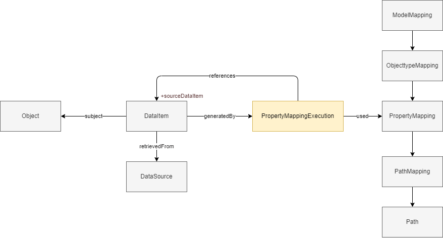

## Requirements and approach
Within this chapter two sections are presented; Requirements and Approach. In the Requirements section the requirements for the information model are listed. In the Approach section the requirements are translated into a conceptual model which forms the basis for the logical model described in [chapter 5](#lineage-information-model).

### Requirements

1. **We should be able to identify and describe singular data elements.**
2.  **We should be able to describe which data elements contributed to the generation of a data element**
3. **We should be able to describe actvities that act upon data elements.**
4. **We should be able to find data elements that contributed to the generation of a data element**
5. **We should be able to describe how data elements contributed to the generation of a data element**


<!-- 2. **We should be able to trace back data elements to those it is derived from.** -->
<!-- 2. **We should be able to describe lineage-relationships between data elements.** -->

### Approach

The first notion we introduce is that of a single statement or data element. Information objects we consume to draw insights from or base decisions on are comprised out of multiple atomic units of information, each captured by one attribute or association. Consider the following information object in JSON:

<pre>
{
  "omschrijving": "Laan van Westenenk 701, 7334DP Apeldoorn",
  "plaatsnaam": "Apeldoorn",
  "identificatie": "0200200000075716",
  "isHoofdadres": true,
  "huisnummer": 701,
  "postcode": "7334DP",
  "straatnaam": "Laan van Westenenk"
}
</pre>

Or, in RDF:

<pre>
&lt;http://example.com/id/adres/0200200000075716&gt; a gebouw:Adres;
  gebouw:postcode "7334DP";
  gebouw:huisnummer 701;
  gebouw:identificatie "0200200000075716";
  gebouw:omschrijving "Laan van Westenenk 701, 7334DP Apeldoorn";
  nen3610:registratiegegevens &lt;http://example.com/base/registratiegegevens-0200200000075716&gt;;
  gebouw:straatnaam "Laan van Westenenk";
  gebouw:plaatsnaam "Apeldoorn";
  gebouw:isHoofdadres true .
</pre>

Each data element can have its own lineage; its own algorithm to determine the given value. By treating these data elements as object; allows us to describe and provide information about them. For instance to state that `{ "plaatsnaam": "Apeldoorn" }` is derived from a data element in the BAG. 
In the following diagram both the object and the data elements are modelled as an objecttype, as they are things; objects, we are interested in describing.


A data element is identified by it's 1) subject 2) value and 3) property
e.g.
```
{
    "property": "plaatsnaam",
    "value": {
        "stringValue": "Apeldoorn"
    },
    "subject": {
        "identificatie": "0200200000075716",
        "domein": null
    }
}
```

| Term         | Definition                                                               |
| ------------ | ------------------------------------------------------------------------ |
| object       | An object is any resource that is the subject of a registration.         |
| data element | A data element is any singular piece of information about a resource.    |
| subject      | A subject is an object a data element is about.                          |
| property     | A property is the characteristic of the subject a data element is about. |
| value        | The value of a data element.                                             |

Several subtypes of data elements are identified; but these are omitted in the following examples for simplicity's sake.


A data element can be described from different point of views. The perpective the lineage model takes is one of provenance. Questions to be answered include, for instance, where, how and by whom, is the statement `Building G0200.42b3d39246840268e0530a0a28492340 has construction date 2006` created? Other models could address other aspects of a data element; for instance whether it is subject to an examination of correctness (which could be relevant for the BAG: https://catalogus.kadaster.nl/bag/nl/page/InOnderzoek) or what is the quality of a data element. 

A data element is part of the information object describing an object; but this is omitted in the following examples.


This gives a basic model applicable for many usecases. This lineage model add to this a way to connect one data element to one or more other data elements it is derived from. The latter are called source data elements, the former orchestrated data elements.
For the source data elements it is important to know which registry or dataset it is retrieved from so that users can interpret the source data element in the context it was published in. This also allows allows users to find related information.


<pre>
{
    "identification": "G0200.42b3d39246840268e0530a0a28492340",
    "constructionDate": "2006",
    "registeredWith": {
        "consistOf": [
            {
                "property": "bouwjaar",
                "value": {
                    "stringValue": "2006"
                },
                "subject": {
                    "identificatie": "G0200.42b3d39246840268e0530a0a28492340",
                    "domein": null
                },
                "wasDerivedFrom": {
                    "property": "oorspronkelijkBouwjaar",
                    "value": {
                        "stringValue": "2006"
                    },
                    "subject": {
                        "identificatie": "0200100000085932",
                        "type": Pand
                    }
                }
            }
        ]
    }
}
</pre>

| Term                      | Definition                                                                                              |
| ------------------------- | ------------------------------------------------------------------------------------------------------- |
| source data element       | A source data element is a data element that is used for the creation of a new data element.            |
| orchestrated data element | A orchestrated data element is a data element that is created using one or more source data element(s). |
| registration              | A registration is a record of a set of data elements.                                                   |
| registry                  | A registry is a dataset a source data element can be retrieved from using a data service.               |

This, however, does not provide any insight into how the source data element(s) were used to generate the data element. In order to allow for this the generation itself is identified as an orchestration activity, which is a type of activity. This provides the information that the data element is generated using orchestration techniques.


<pre>
{
    "identification": "G0200.42b3d39246840268e0530a0a28492340",
    "constructionDate": "2006",
    "registeredWith": {
        "consistsOf": [
            {
                "property": "bouwjaar",
                "wasGeneratedBy": {
                    "used": {
                        "property": "oorspronkelijkBouwjaar",
                        "value": {
                            "stringValue": "2006"
                        },
                        "subject": {
                            "identificatie": "0200100000085932",
                            "type": Pand
                        }
                    }
                },
                "value": {
                    "stringValue": "2006"
                },
                "subject": {
                    "identificatie": "G0200.42b3d39246840268e0530a0a28492340",
                    "domein": null
                }
            }
        ]
    }
}
</pre>

Lastly we provide insights into the transformation itself, the mapping used for the orchestration activity. The mapping is described in a seperate artifact called the mapping document. This document describes the relation between two models and how data from one can be transformed to the other. The mapping is structured according to the [mapping standard](https://github.com/Geonovum/WaU-MAP). The rules to generate a specific data element are encompassed in a property mapping. This is what is executed. We introduce a specific type of orchestration activity.

| Term                       | Definition                                                                                                                   |
| -------------------------- | ---------------------------------------------------------------------------------------------------------------------------- |
| orchestration activity     | An orchestration activity is an activity that generates a set of data elements based on one or more sources using a mapping. |
| property mapping execution | A property mapping execution is an orchestration activity where a specific property mapping is executed.                     |



The Property mapping execustion can be deconstructed into several smaller activities as it may include multiple intermediary results; each having a query path and a startnode, which are then combined and/or transformed into the value of the orchestrated data element. The PropertyMapping is the main entity describing, in order, the steps (PropertyPathMappings) required to derive a specific data element. Each step is an activity that informs the property mapping execution; which yield the orchestrated data element. As part of the lineage information we refer to elements in the mapping to provide insights into how the orchestrated data element was constructed. This allows us to provide insight into which, and how, data elements were used to derive a new data element. Adding this to our lineage model yields the following model.

| Term                    | Definition                                                                                   |
| ----------------------- | -------------------------------------------------------------------------------------------- |
| was informed by         | A relation between activities stating that one activity uses some output of the other activity. |
| property path execution | A property path execution is an activity that retrieves data elements to serve as input for the property mapping execution. |
| references              | Referemces indicates the source data element used in a property path execution. |
| start node              | Start node indicated the source object from which property paths are traversed to find source data elements. |

<!-- 
A propertyPathMapping consists out of one or more propertyPaths; each targetting one or more data elements. The lineage should give insights on precisely how each data element is found and how it contributed to the generation of the orchestrated data element. For each `"OrchestrationActivity -used-> DataElement"` we map to the respective PropertyPath.

We do this by qualifying the used relation between the Orchestration Activity and the (source)data element. This allows us to point to the exact mapping element providing the property path that leads us to the source data element. To this qualified relation we add a pointer to the node from which the path is followed. This is the start node. 
<div class="note">This is one approach and we might opt for another</div> -->


In this model several types have different roles following from incomming relations. This could make the datamodel less clear. In the following diagram roles are made explicit.


| Term                    | Definition                                                                                   |
| ----------------------- | -------------------------------------------------------------------------------------------- |
| source object           | A source object is an object that that is referenced to create an orchestrated data element. |
| source data element     | A source data element is a data element that is used to create an orchestrated data element. |
| property path execution | A property path execution is an activity where a property path mapping is executed.          |

In JSON this could look as follows.

<pre>
{
    "identification": "G0200.42b3d39246840268e0530a0a28492340",
    "constructionDate": "2006",
    "hasLineage": {
        "orchestratedProperties": [
            { <!-- OrchestratedDataElement -->
                "property": "bouwjaar",
                "value": {
                    "stringValue": "2006"
                },
                "subject": {
                    "identificatie": "G0200.42b3d39246840268e0530a0a28492340",
                    "domein": null
                },
                "wasGeneratedBy": { <!-- PropertyMappingExecution -->
                    "used" : {  <!-- property mapping -->
                        "objectKey": "MAP.IMXGEO.000102",
                        "objectType": "PropertyMapping"
                    }
                    "wasInformedBy": { <!-- PropertyPathExecution -->
                        "references": { <!-- source data element -->
                            "property": "oorspronkelijkBouwjaar",
                            "value": {
                                "stringValue": "2006"
                            },
                            "subject": {
                                "objectKey": "0200100000085932",
                                "objectType": Pand
                            }
                        },
                        "used": { <!-- PropertyPath -->
                            "path": {
                                "segments": [
                                    "isGerelateerdAan",
                                    "oorspronkelijkBouwjaar"
                                ]
                            }
                        },
                        "startNode": { <!-- SourceObject --> 
                            "objectKey": "G0200.42b3d39246840268e0530a0a28492340",
                            "objectType": "Pand"
                        }
                    }
                }
            }
        ]
    }
}
</pre>
When multiple source data elements are used this would result in multiple `"wasInformedBy": { ... }` statements within the `"wasGeneratedBy":{ ... }` element.

#### Summary

The requirements are reflected in the model by introducing the following concepts:
- **Data element**
  - "orchestrated data element" for req 1
  - "source data element" for req 2.
  
   In order to describe lineage information about date elements we need to be able to talk about them.
- **Orchestration Activity**
  - Property Mapping execution and property path execution for req 3
  
  In order to describe that orchestration took place.
- **Registry** for req 4.
  
  In order to decribe where source data is retrieved from and thus can be found.
- **Mapping element**
  -  Property Mapping and property path for req 5.
  
  In order to precisely indicate what rules were applied to the source data to derive the orchestrated data.

In short:


#### Limitations

- We don't have a way of indicating the order of the propertyPathExecution activities which is present in the mapping.
- We don't have a way of describing the (software) agent responsible for the orchestration (can be copied from PROV-O).
- We don't have a way of connecting the set of activities that contributed to a response. E.g. all activities for an execution of a objecttype mapping.
- ...