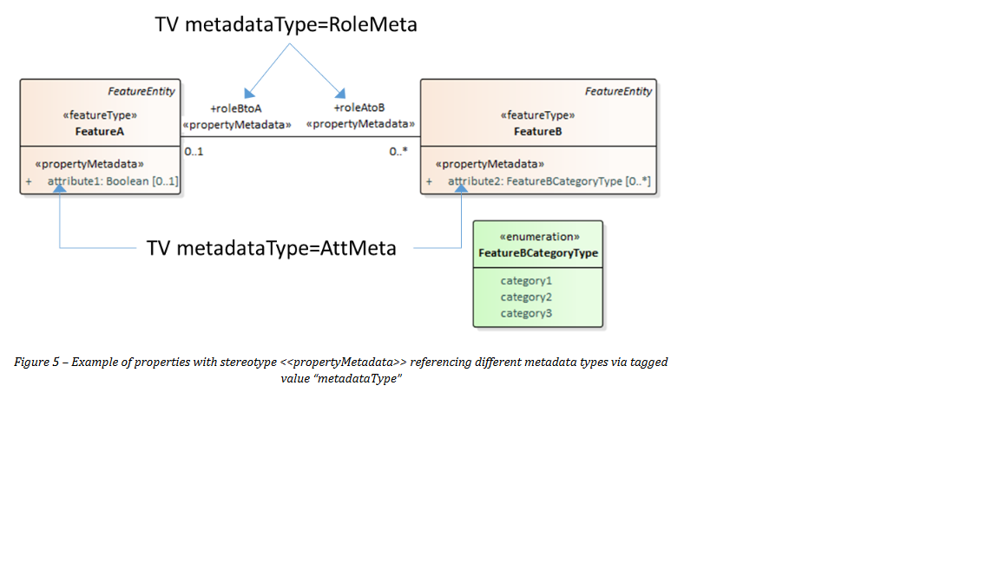
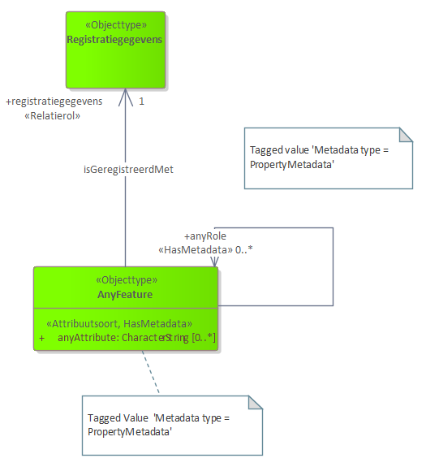

## Metadata MIM extension

Lineage information is considered as metadata in relation to elements in a productmodel. For this reason we consider lineage as metadata and will provide a common solution to relate metadata to semantics of a productmodel.

# Requirements

The lineage model provides lineage information as metadata at the property level .

Requierments of the metadata in this respect are the following:

1. metadata at the property level of objecttypes
2. metadata at the instance level of properties
3. metadata can optionally be published
4. metadata model does not have effect on a productmodel

ad 1,2: UML-MIM does not have a construct to bind (meta)data at properties, i.e. attributes or association ends. It is therefore necessary to extend UML-MIM.

ad 3,4: The metadata or in this case lineage model is modelled independently from the product model. Both are 'loosely' connected.

An approach to these requiremnst can be found in the [[Property-Stereotype-for-Metadata]]. This publication presents an UML extension through a stereotype `«propertyMetadata»` and a tagged value `metadataType`. An example is presented below.

<figure id="Figure_1">

<figcaption>Example showing use of stereotype: Properties with stereotype `«HasMetadata»` reference metadata types via tagged value `metadataType`. Source:[[Property-Stereotype-for-Metadata]]</figcaption>
</figure>

The above presented pattern is slightly adapted by changing the sterotype name from propertyMetadata to a general `«HasMetadata»`. The pattern is presented below on a general class AnyFeature representing any possible feature type in a productmodel.

<figure id="Figure_2">

<figcaption>Metadata expressed at the conceptual level of a productmodel</figcaption>
</figure>

Explanation and definition.

Stereotype «HasMetadata»
>   **Definition «HasMetadata»**  
>   This element has associated metadata.

Description:
The stereotype specifies that this information element has metadata associated. This is a specification at the conceptual level. A related tagged value `Metadata type` specifies the association to specific metadata.

Tagged Value: Metadata type
>   **Definition Metadata type**  
>   Name of the target class of associated metadata.

Description:
This tagged value specifies the relation to a specific target class of or in a specific metadata model. This target class serves as the receptor defining the type of metadata that is associated.

In figure 2 the value for `Metadata type = PropertyMetadata` is only an example and may differ according to the required metadata class that relates to the specified metadata.

# MIM-UML extension

The defined stereotype and related tagged value lead to an extension of the MIM model. As the extension for now is independent from MIM teh extension is described both as an extension of the UML metamodel and the MIM-UML model.

**Extension on UML**

<figure id="Figure_3">

<figcaption>Stereotype `«HasMetadata»` as extension on UML metaclasses</figcaption>
</figure>

**Extension on MIM-UML**

<figure id="Figure_4">

<figcaption>Todo: Stereotype `«HasMetadata»` as extension on MIM-UML metaclasses</figcaption>
</figure>
 

# Implementation, encoding.

The challenges regarding the implementation of this conceptual metadata construct vary across different encoding formats. For example in XML a construct exists to add attributes to XML elements, which provides a means to give attributes to properties, in this case reference to a metadata object. In JSON this does not exist. The `«HasMetadata»` stereotype is therefore extended with a model transformation that objectifies properties of a productmodel. The objectified properties are not part of the productmodel but serve as a loosly coupled intermediate binding mechanism between data and metadata.

The UML model of this pattern is presented below.

<figure id="Figure_5">

<figcaption>Pattern for the Metadata binding model. Objectification of properties.</figcaption>
</figure>

Explanation of diagram.  
The Metadata binding model serves as a objectification of the properties of the productmodel. Each property (attributes and association roles) is transfomed to an instance of the objecttype `PropertyType` having its name in `propertName`. Depending on the type of property (or its associated value type) a SimplePropertData, ComplexPropertyData or the AssociationPropertyData is chosen.
SimplePropertyData for properties with a unstructured valuetypes, ComplexPropertyData for structured valuetypes and AssociationPropertyData for association roles.
The value of a property is transformed to the `value` attribute or the `value` association role.

In this model there is no explicit information link between a property and its value of the productmodel and its objectified `PropertyData` and value instance. To bind data of the productmodel to instances of 'PropertyData' is bij convention. The convention is that instances from objecttypes of the Productmodel and its properties and values by convention are bindend to instances of PropertyData and values in the Metadata Binding Model having the value for `propertName` and `value` equal to the name of the property and its value.  
So without specifying apart for the three subtypes of `PropertyData` the convention rule is: `Productmodel.property = PropertyData.propertyName AND Productmodel.property.value = PropertyData.value`

